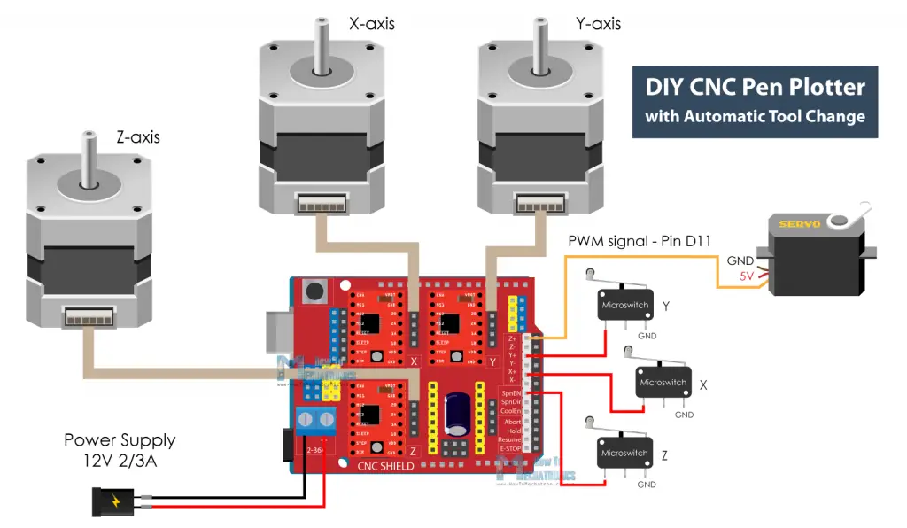

# CNC Pen Plotter
My project is a CNC Pen Plotter which is a machine that can draw. It uses acrylic mounts that support linear rails and stepper motors. The motors move a pulley belt around which permits the machine to move around an XY plane similar to the movement of a 3d printer except in 2d. It has a servo motor at the end of one mount which acts as the pen up and down function which is the z-axis in this case. It has an Arduino uno with A4988 stepper drivers attached which is the main board connected to all the motors. The machine uses gcode to give instructions to the CNC machine and it takes that and draws.  

|:--:|:--:|:--:|:--:|
|**Engineer**|**School**|**Area of Interest**|**Grade**|
| Deven K | Mountain View High School | Mechanical Engineering | Incoming Freshman |

  
# Final Milestone
<iframe width="560" height="315" src="https://www.youtube.com/embed/Q0wurrk0d7g" title="YouTube video player" frameborder="0" allow="accelerometer; autoplay; clipboard-write; encrypted-media; gyroscope; picture-in-picture; web-share" allowfullscreen></iframe>

 For my final milestone, I completed a drawing of my own. To do this I would have to find an image that wouldn't be too difficult for the machine and it would have to be the right size
I found a cool Greek pattern and resized it so it would fit on the plane and then converted it into a code file. I experimented around with it and found that the machine made lines when it was trying to travel around the plane which ruined the drawing. To fix this, I had to go into notepad ++ and find all the places where this is the G0 commands which is where all the unwanted lines where I added M5 before and M3S500 after which puts the pen up and then down so there are no extra lines
After that, I was set to test, and this time it worked very well creating the image with minimal errors.
# Second Milestone 

<iframe width="560" height="315" src="https://www.youtube.com/embed/ejIaXOi90mk" title="YouTube video player" frameborder="0" allow="accelerometer; autoplay; clipboard-write; encrypted-media; gyroscope; picture-in-picture; web-share" allowfullscreen></iframe>

For the 2nd Milestone, I worked on the software for this project, so it could complete a drawing
First, I flashed the Arduino Uno with the firmware that was provided with the kit, so the machine would have basic instructions installed.
Next, I installed Universal G-Code Sender and changed a few settings to match the machine. This program allows me to send gcode to CNC machines and give mine the instructions to draw. To complete my drawing I first need to create  a gcode for the machine that I can use to test it. To test, I wanted to start with something simple, so I  downloaded and copied a simple equilateral triangle and converted it to SVG, and then searched for an SVG --> to GCODE converter on GitHub. I found one quite easily and after that, I was ready to test. A few challenges were the pen wasn't always stable and the paper surface wasn't completely smooth either which caused there to be smudges and parts where the machine couldn't pass through.
After tinkering around with it and adjusting it for better results I re-tested but this time with a harder gcode.

# First Milestone

<iframe width="560" height="315" src="https://www.youtube.com/embed/wHJjRqvzGj0" title="YouTube video player" frameborder="0" allow="accelerometer; autoplay; clipboard-write; encrypted-media; gyroscope; picture-in-picture; web-share" allowfullscreen></iframe>

My project is the CNC Pen Plotter, which is basically a drawing machine. For my first milestone, I completed the assembly of the project
 It utilizes acrylic pedestals and mounts that hold up the motors, and bearings for the rails, and have slots to tighten the rails. It also has stepper and servo motors to move a pulley belt around so the machine can move around an XY plane and draw. An aluminum profile holds the cables for the connections of the stepper and servo motors. Some challenges were that the nuts weren't all tight enough so the parts could move around causing there to be errors in the drawing. To fix this I had to use a screwdriver to secure it very tightly so I wouldn't have to re-adjust it after. I also had trouble with some of the screws, but I realized that it is because the acrylic parts weren't in the exact spots and weren't layered correctly, but those are easy fixes. Afterward, I plan to test some of the g-codes that were given with the project and then create my own.

# Starter Project

<iframe width="560" height="315" src="https://www.youtube.com/embed/Tg4g277qics?start=1" title="YouTube video player" frameborder="0" allow="accelerometer; autoplay; clipboard-write; encrypted-media; gyroscope; picture-in-picture; web-share" allowfullscreen></iframe>

Initially, I had tried to complete the digital clock but I had struggled with the little room for soldering and because of this, I had short-circuited an IC chip which killed the clock. I wasn't able to solder carefully enough for the jam-packed board, so I chose the Robot badge with blinking LEDs since it had much more room for the solder.  I would need to have good soldering skills for my main project, so this project was really simple but it was an easy way to learn and develop my soldering skills. To assemble I soldered a battery holder and 2 LEDS onto the board and then attached a 3-volt battery, and a clip so it could attach to something.

# Schematics 

# Bill of Materials

| **Part** | 	**Price** | 	**Link**
|:--:|:--:|:--:|
|2 PCS  8mm polished rods 450mm|	$18.99|	<a href="https://www.amazon.com/Linear-Motion-inches-Hardened-Printer/dp/B08JGHHQCN/ref=asc_df_B08JGHHQCN/?tag=hyprod-20&linkCode=df0&hvadid=564821841578&hvpos=&hvnetw=g&hvrand=14700202961006999446&hvpone=&hvptwo=&hvqmt=&hvdev=c&hvdvcmdl=&hvlocint=&hvlocphy=9032171&hvtargid=pla-1362812653839&psc=1/"> Link </a>|
|2 PCS  8mm polished rods 360mm|	$9.95|<a href="https://vxb.com/products/8mm-shaft-370mm-14-567-hardened-rod-linear-motion?variant=43580347646187&currency=USD&utm_medium=product_sync&utm_source=google&utm_content=sag_organic&utm_campaign=sag_organic&tm=tt&ap=gads&aaid=adaxXEtq4CiMg&gclid=EAIaIQobChMIypf0hIPn_wIV2R-tBh2nsQfpEAQYAiABEgJjuvD_BwE/"> Link </a>	|
|Timing belt 1.5m|	$10.99|	<a href="https://us.misumi-ec.com/vona2/detail/221000230640/"> Link </a>|
|Linear Guide Assembly|	$19.68|	<a href="https://www.amazon.com/CNCMANS-Bearing-Carriage-Printer-15-74inch/dp/B09QPHP21S/ref=asc_df_B09QPHP21S/?tag=hyprod-20&linkCode=df0&hvadid=658706434542&hvpos=&hvnetw=g&hvrand=6445786232967847568&hvpone=&hvptwo=&hvqmt=&hvdev=c&hvdvcmdl=&hvlocint=&hvlocphy=9032171&hvtargid=pla-2080939290445&psc=1&gclid=EAIaIQobChMIosu6uobn_wIVdQKtBh2mDQ4mEAQYBiABEgLQ_vD_BwE/"> Link </a>|
|42 Stepper motor|	$9.99|	<a href="https://www.amazon.com/Creativity-Stepper-Stepping-Extruder-Compatible/dp/B09L81TWYC/ref=asc_df_B09L81TWYC/?tag=hyprod-20&linkCode=df0&hvadid=652590917229&hvpos=&hvnetw=g&hvrand=7593275423695765603&hvpone=&hvptwo=&hvqmt=&hvdev=c&hvdvcmdl=&hvlocint=&hvlocphy=9032171&hvtargid=pla-2061832990449&psc=1&gclid=EAIaIQobChMIzLnBgofn_wIVGzKtBh0QpADtEAQYASABEgLdDPD_BwE"> Link </a>|
|Arduino controller|	$26.99|	<a href="https://www.amazon.com/Control-Engraving-Machine-Motherboard-Corexy/dp/B09DWYRWP8"> Link </a>|
|MG90 steering gear|	$8.49|	<a href="https://www.amazon.com/Replace-Helicopter-Airplane-Controls-Vehicle/dp/B09KXM5L7Z/ref=asc_df_B09KXM5L7Z/?tag=hyprod-20&linkCode=df0&hvadid=647294738363&hvpos=&hvnetw=g&hvrand=5834326162893392175&hvpone=&hvptwo=&hvqmt=&hvdev=c&hvdvcmdl=&hvlocint=&hvlocphy=9032171&hvtargid=pla-1747954003806&psc=1&gclid=EAIaIQobChMI_Pe17onn_wIVsB6tBh2x6A8XEAQYASABEgIGXPD_BwE"> Link </a>|
|Power Supply|	$12.99|	<a href="https://www.amazon.com/COOLM-Adapter-100-240V-Security-Monitoring/dp/B07D5C745W/ref=asc_df_B07D5C745W/?tag=hyprod-20&linkCode=df0&hvadid=647221673261&hvpos=&hvnetw=g&hvrand=14295083690959649477&hvpone=&hvptwo=&hvqmt=&hvdev=c&hvdvcmdl=&hvlocint=&hvlocphy=9032171&hvtargid=pla-1948335663726&psc=1&gclid=EAIaIQobChMIob3o-Yrn_wIV5h-tBh0xOQG2EAQYASABEgJfz_D_BwE"> Link </a>|
# Aditional Resources
Pen Plotter guide : https://howtomechatronics.com/projects/diy-pen-plotter-with-automatic-tool-changer-cnc-drawing-machine

